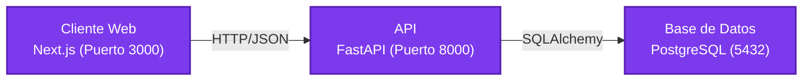

# Diagrama de Arquitectura

## Visión General

El proyecto sigue una arquitectura de **tres capas** con separación clara entre cliente, servidor y base de datos.

## Componentes

| Capa | Tecnología | Puerto | Descripción |
|------|-----------|--------|-------------|
| **Frontend** | Next.js | 3000 | Interfaz de usuario, renderizado del lado del cliente/servidor |
| **Backend** | FastAPI | 8000 | API REST, lógica de negocio, validación de datos |
| **Base de Datos** | PostgreSQL | 5432 | Persistencia de datos relacional |

## Comunicación

- **Frontend ↔ Backend:** Protocolo HTTP con intercambio de datos en formato JSON.
- **Backend ↔ Base de Datos:** ORM SQLAlchemy para mapeo objeto-relacional y consultas.

### ¿POR QUE ESTA ARQUITECTURA SE BENEFICIA MAS DE ENFOQUES AGILES QUE TRADICIONALES?
 Esta arquitectura permite cambiar fácilmente, entregar valor rápido y recibir retroalimentación temprana, exactamente lo que promueve el enfoque Ágil.